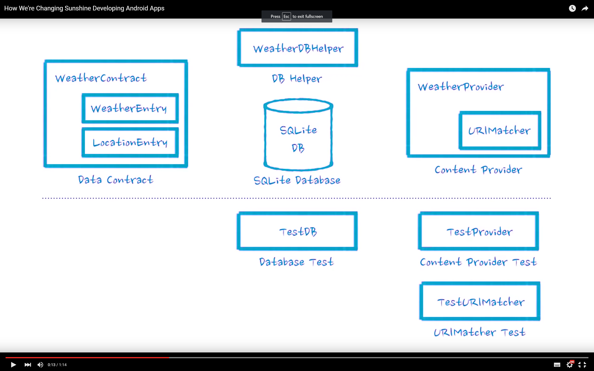
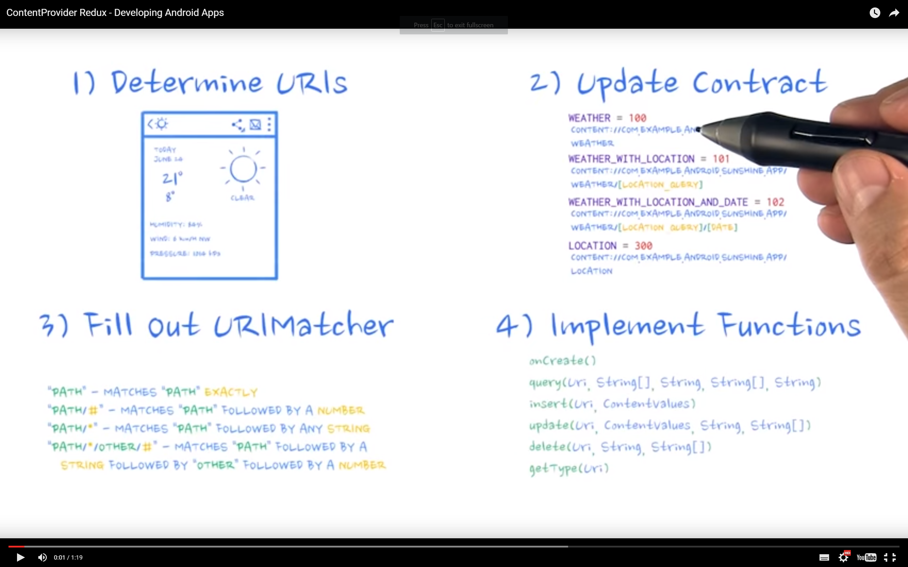

# [Developing Android Apps](https://www.udacity.com/course/progress#!/c-ud853)
@ [Udacity](https://www.udacity.com)
_via [Springboard](http://www.springboard.com)'s [Android App Development](https://www.springboard.com/learning-paths/android/ path
## Lesson 4

_because of its scope, lesson 4 was split into 3 lessons_

###4a
#### Lifecycle
[Process and Application Lifecycle](http://developer.android.com/guide/topics/processes/process-lifecycle.html)
[Managing the Activity Lifecycle](http://developer.android.com/training/basics/activity-lifecycle/index.html)
the [Activities](http://developer.android.com/guide/components/activities.html) guide has a graphic demonstration of the lifecycle
#### baked-in SQLite data storage

_[overview of changes](https://www.youtube.com/watch?v=Sif4ZAL8iU8)_
_[optional SQLite tutorial](https://www.udacity.com/course/viewer#!/c-ud853/l-3621368730/m-2602608541)_
— you should (also) ensure that you understand SELECT w/ INNER JOIN, and the basic db crud queries
[Storage Options](http://developer.android.com/guide/topics/data/data-storage.html)
[Saving Data](http://developer.android.com/training/basics/data-storage/index.html)
[Saving Data in SQL Databases](http://developer.android.com/training/basics/data-storage/databases.html)
— there is a section on Contracts, which isn't really a structure in android SDK. I think it is covered in the following:
[BaseColumns](http://developer.android.com/reference/android/provider/BaseColumns.html)
[SQLiteOpenHelper](http://developer.android.com/reference/android/database/sqlite/SQLiteOpenHelper.html)
[SQLiteDatabase](http://developer.android.com/reference/android/database/sqlite/SQLiteDatabase.html)

#### a brief intro to testing
— _some lovely references that might be more useful if you are reviewing your notes:_
[Testing Concepts](http://developer.android.com/tools/testing/testing_android.html)
_[Building Effective Unit Tests](http://developer.android.com/training/testing/unit-testing/index.html)_
_[Best Practices for Testing](http://developer.android.com/training/testing/index.html)_
There are two different kinds available out of the box:
[android.test](http://developer.android.com/reference/android/test/package-summary.html)
[junit.framework.test](http://developer.android.com/reference/junit/framework/Test.html)

###4b

####Content Providers
[Content Provider basics](http://developer.android.com/guide/topics/providers/content-provider-basics.html)
[Creating a Content Provider](http://developer.android.com/guide/topics/providers/content-provider-creating.html)
[ContentProvider](http://developer.android.com/reference/android/content/ContentProvider.html)

####Testing It
[Testing Your Content Provider](http://developer.android.com/training/testing/integration-testing/content-provider-testing.html)

####Content URIs
[Content Uris](http://developer.android.com/reference/android/content/ContentUris.html)
[Uri.Builder](http://developer.android.com/reference/android/net/Uri.Builder.html) and 
[UriMatcher](http://developer.android.com/reference/android/content/UriMatcher.html)
[parseId](http://developer.android.com/reference/android/content/ContentUris.html#parseId%28android.net.Uri%29) implements a common convention for API communications

####Using it
[accessing your content from the Content Provider](http://developer.android.com/guide/topics/providers/content-provider-basics.html#ClientProvider)
Provider in [Manifest](http://developer.android.com/guide/topics/manifest/provider-element.html)

[In review video](https://www.udacity.com/course/viewer#!/c-ud853/l-3599339441/m-3655209144)

###4c
####Loaders
[Loaders](http://developer.android.com/guide/components/loaders.html)
[AsyncTaskLoader](http://developer.android.com/reference/android/content/AsyncTaskLoader.html)
[Loader](http://developer.android.com/reference/android/content/Loader.html)
[LoaderManager.LoaderCallbacks](http://developer.android.com/reference/android/app/LoaderManager.LoaderCallbacks.html)

**[Overview of how these classes are used in the app to get data and store through the content uri ](https://www.udacity.com/course/viewer#!/c-ud853/l-3681658545/m-3666728992)**
also [Misc notes for 4c](https://www.udacity.com/course/viewer#!/c-ud853/l-3681658545/m-3649658972) - contains an overview diagram

####Content.CursorLoaders
[CursorLoader](http://developer.android.com/reference/android/content/CursorLoader.html)

_see the example on creating and referencing Projections for the query [here](https://www.udacity.com/course/viewer#!/c-ud853/l-3681658545/e-3650909019/m-3606839932)._ Personally in this app I favor creating and Interface and implementing it as needed.

####ShareActionProvider
_remember [Adding An Easy Share Action](http://developer.android.com/training/sharing/shareaction.html)?_
[ShareActionProvider](http://developer.android.com/reference/android/widget/ShareActionProvider.html)

_[making the Content Provider accessible](http://developer.android.com/guide/topics/providers/content-provider-creating.html#ProviderElement) and [Permissions](http://developer.android.com/guide/topics/providers/content-provider-creating.html#Permissions)_