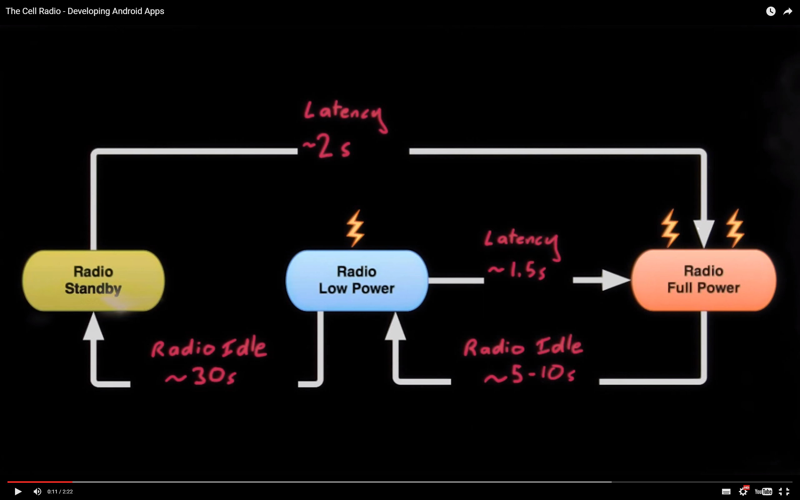
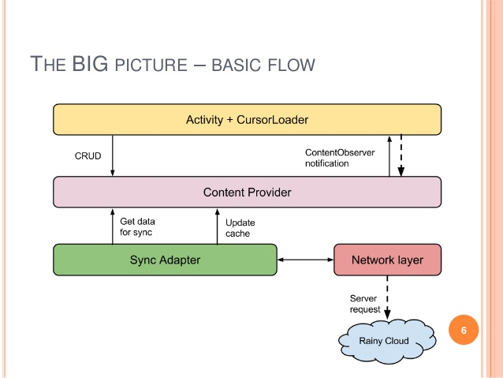

# [Developing Android Apps](https://www.udacity.com/course/progress#!/c-ud853)
@ [Udacity](https://www.udacity.com)
_via [Springboard](http://www.springboard.com)'s [Android App Development](https://www.springboard.com/learning-paths/android/ path
## Lesson 6

_Services and notifications_ 

In this section you'll learn more about how the android framework manages apps in the background, and you'll learn about andoird services to help make it happen. You'll also learn efficient messaging through SyncAdapters using Google Cloud Messaging. You'll learn about the notification framework to send messages to your users from the background. 

### Apps in the background

A problem with the implementation we have done with asynctask transferring data from the background is that it is done directly from the activity. This has disadvantages:

* the activity is referenced in memory by the asynctask even after its `onDestroy` is called (like when the user switches tasks), and so can't free up its memory.
* the activity will start anew when you come back to it, like during a screen rotation. Now you have two (or more) `asynctasks` running to accomplish the same fundamental goal.
* rapid updates can cause undesired behavior ??

The solution is to use a service.

### Services

You start a service by passing in an intent to a `startService(myService)` call. You can stop them the same way, by calling `stopService(myService)`.

Services have a simplified lifecycle, going from `oncreate` to `onStartCommand` to `onDestroy`. Typically, you'll only need to override `onStartCommand` to begin the background task (this needs to be in an AsyncTask or other separate thread).

Servicesin background apps that need a higher priority to operate properly (like a music player) can call `startForground(notification)` to request elevated priority. The notification cannot be dismissed while the app is in the background.

The easiest service class to use for common uses is the `IntentService` class. This creates a queue for `startService` intent requests, and creates a background thread that needs to be implemented in `onHandleIntent`. Another is the `syncAdapater`, designed to synchronize data in the background.

_see also_
[Services](http://developer.android.com/guide/components/services.html) Guide

### App Priority

Apps are priotized in one of 3 buckets, "low", "high", and "critical".

* critical — active activities, foreground services
* high — visible activities, running services
* low — the most likely to be killed as needed for memory conservation and supporting the higher priority apps use of cpu time.

This is done following the "Android Resource Management" design criteria of:

1. android will ensure a smooth UX
2. android will keep visible activities and all services running (except when contrary to rule #1)
3. android will keep all background processes running (excepting the first two rules)

### [Alarm Manager](http://developer.android.com/reference/android/app/AlarmManager.html)
The AlarmManager fires PendingIntents. PendingIntents are wrappers for explicit Intents. You can use an explicit intent to trigger AlarmReceiver. Your goal here is to set up the explicit intent, wrap it in a PendingIntent, and set the constraints under which your PendingIntent should be fired with an AlarmManager.

PendingIntents are not created with constructors, rather, as stated in the [documentation](http://developer.android.com/reference/android/app/PendingIntent.html) “Instances of this class are created with `getActivity(Context, int, Intent, int)`, `getActivities(Context, int, Intent[], int)`, `getBroadcast(Context, int, Intent, int), and getService(Context, int, Intent, int)`”.

_see also_
* [Set a repeating alarm](https://developer.android.com/training/scheduling/alarms.html#set)
* [Pending intent](http://developer.android.com/reference/android/app/PendingIntent.html)
* [Lesson 3: Broadcast Intents](https://www.udacity.com/course/viewer#!/c-ud853/l-1474559101/m-1631278613)
* [BroadcastReceiver](http://developer.android.com/reference/android/content/BroadcastReceiver.html)

### aside: [Waking the device](http://stackoverflow.com/questions/3621599/wake-android-device-up#answer-10179932)

To wake up the screen:

    PowerManager pm = (PowerManager) getApplicationContext().getSystemService(Context.POWER_SERVICE);
    WakeLock wakeLock = pm.newWakeLock((PowerManager.SCREEN_BRIGHT_WAKE_LOCK | PowerManager.FULL_WAKE_LOCK | PowerManager.ACQUIRE_CAUSES_WAKEUP), "TAG");
    wakeLock.acquire();
To release the screen lock:

    KeyguardManager keyguardManager = (KeyguardManager) getApplicationContext().getSystemService(Context.KEYGUARD_SERVICE); 
    KeyguardLock keyguardLock = keyguardManager.newKeyguardLock("TAG");
    keyguardLock.disableKeyguard();
And the manifest needs to contain:

    <uses-permission android:name="android.permission.WAKE_LOCK" />
    <uses-permission android:name="android.permission.DISABLE_KEYGUARD" />
For more details about PowerManager, refer to the [API documentation](http://developer.android.com/reference/android/os/PowerManager.html)

### Power Use

_In the diagram, the specific times between states changes based on **the carrier**, and adapts to prevailing network conditions._

It turns out that powering the mobile radio is one of the largest power draws in the system. The best way to limit this cost is to batch your network requests.

_see also_
* [Transferring data without wasteful battery drain](http://developer.android.com/training/efficient-downloads/index.html)
* video: [Devbytes: Efficient data transfers](https://www.youtube.com/watch?v=cSIB2pDvH3E&list=PLWz5rJ2EKKc-VJS9WQlj9xM_ygPopZ-Qd)

### SyncAdapters

SyncAdapters schedule transfers from multiple apps to group together calls to power the radio. It also implements logic to restart your request, in case network conditions were poor enough to drop the connection.

SyncAdapter sync could be trigger by the user or by the system.

SyncAdapter requires:

1. Authentication -> to validate user and get token.
2. ContentProvider -> Local storage access (sqlite etc)
3.  Your Custom methods for syncing (SyncHelper).

Here is a quick flow chart that should help you to get a better understanding of SyncAdapter.

1. SyncAdapter is trigger, getAuthToken() from Authenticator
2. If token Authenticator will return token else get token from system (if username and password stored in AccountManger) else show Login Activty/Fragment
3. Validate user return token and add user to AccountManager
4. SyncAdapter will pass token to processor (SyncHelper in my case)
5. SyncHelper custom class has methods of checking your db if there is anything to sync.
6. Content Provider will be used to get data from db and notify Fragments/Activities for changes (not in the diagram)
7. Return data that needs to be synced.
8. SyncHelper will get the data ready and pass it to HTTP Client
9. HTTP  Client will process the request and send it to server
10. HTTP Client will check if request data was OK if not send invalid Token Authenticator
11. Return good data to SyncHelper, SyncHelper will send insert/update/delete as needed to Content Provider.

#### Implementing a Sync Adapter

_see_
[AbstractThreadedSyncAdapter](http://developer.android.com/reference/android/content/AbstractThreadedSyncAdapter.html)

#####The control flow

1. Your MainActivity is created and the sync adapter is initialized.
2. During initialization, getSyncAccount is called.
3. getSyncAccount will create a new account if no sunshine.example.com account exists. If this is the case, onAccountCreated will be called.
4. onAccountCreated configures the periodic sync and calls for an immediate sync. At this point, Sunshine will sync with the Open Weather API either every 3 hours (if the build version is less than KitKat) or everyone 1 hour (if the build version is greater than or equal to KitKat)

_see also_
* [Creating a SyncAdapter](http://developer.android.com/training/sync-adapters/creating-sync-adapter.html)

##### SyncAdapters and Sunshine

Throughout this course you’ve been learning about different ways to handle Sunshine’s need to do data processing and network calls off of the main thread. For the network call to the Open Weather Map API, the best solution is to use a SyncAdapter. Why? Well SyncAdapters are meant to keep local data on the device in sync with data on the web. This is exactly what we’re doing with Open Weather Map. We’re storing a local cache of weather data from Open Weather Map, with the goal of fast load times, offline functionality and not necessitating a network call every time we load an activity.

Additionally, using a Sync Adapter will intelligently maintain a balance between keeping our local weather data cache up to date and saving the battery by being smart about when to place network calls.

Many of the normal use cases for sync adapters involve syncing the app's local data with information from an online account. For example, in an email app, a sync adapter might be used to pull down a user’s emails at regular intervals. Of course to do this the email app would need to store the user’s account information, such as a username and password, so that the app could log in and grab the new messages. To manage this, sync adapters each have a concept of a user’s account, tied with the sync adapter.

Does Open Weather Map need a user account? No. But we still needed to implement the classes to handle accounts.

_see also_
* [Running a SyncAdapter](http://developer.android.com/training/sync-adapters/running-sync-adapter.html)

##### Setting up periodic intervals of a background sync

1. Have a `ContentProvider` marked as syncable in the manifest
2. Set an interval time in seconds

    // Interval at which to sync with the weather, in seconds.
    // 60 seconds (1 minute) * 180 = 3 hours
    public static final int SYNC_INTERVAL = 60 * 180;
    public static final int SYNC_FLEXTIME = SYNC_INTERVAL/3; 
    ...
    
        /**
     * Helper method to schedule the sync adapter periodic execution
     */
    public static void configurePeriodicSync(Context context, int syncInterval, int flexTime) {
        Account account = getSyncAccount(context);
        String authority = context.getString(R.string.content_authority);
        if (Build.VERSION.SDK_INT >= Build.VERSION_CODES.KITKAT) {
            // we can enable inexact timers in our periodic sync
            SyncRequest request = new SyncRequest.Builder().
                    syncPeriodic(syncInterval, flexTime).
                    setSyncAdapter(account, authority).
                    setExtras(new Bundle()).build();
            ContentResolver.requestSync(request);
        } else {
            ContentResolver.addPeriodicSync(account,
                    authority, new Bundle(), syncInterval);
        }
    }
    
3. enable automatic sync for the `SyncAdapter`

    private static void onAccountCreated(Account newAccount, Context context) {
        /*
         * Since we've created an account
         */
        SunshineSyncAdapter.configurePeriodicSync(context, SYNC_INTERVAL, SYNC_FLEXTIME);

        /*
         * Without calling setSyncAutomatically, our periodic sync will not be enabled.
         */
        ContentResolver.setSyncAutomatically(newAccount, context.getString(R.string.content_authority), true);

        /*
         * Finally, let's do a sync to get things started
         */
        syncImmediately(context);
    }

    public static void initializeSyncAdapter(Context context) {
        getSyncAccount(context);
    }
4. Do an initial, immediate sync.
  * Add the line `onAccountCreated()` to the method `getSyncAccount` after you find that a new account has been created.

    /**
     * Helper method to get the fake account to be used with SyncAdapter, or make a new one
     * if the fake account doesn't exist yet.  If we make a new account, we call the
     * onAccountCreated method so we can initialize things.
     *
     * @param context The context used to access the account service
     * @return a fake account.
     */
    public static Account getSyncAccount(Context context) {
        // Get an instance of the Android account manager
        AccountManager accountManager =
                (AccountManager) context.getSystemService(Context.ACCOUNT_SERVICE);

        // Create the account type and default account
        Account newAccount = new Account(
                context.getString(R.string.app_name), context.getString(R.string.sync_account_type));

        // If the password doesn't exist, the account doesn't exist
        if ( null == accountManager.getPassword(newAccount) ) {

        /*
         * Add the account and account type, no password or user data
         * If successful, return the Account object, otherwise report an error.
         */
            if (!accountManager.addAccountExplicitly(newAccount, "", null)) {
                return null;
            }
            /*
             * If you don't set android:syncable="true" in
             * in your <provider> element in the manifest,
             * then call ContentResolver.setIsSyncable(account, AUTHORITY, 1)
             * here.
             */

            onAccountCreated(newAccount, context);
        }
        return newAccount;
    }

  * In `MainActivity`, at the end of it call: `SunshineSyncAdapter.initializeSyncAdapter(this);`
  
#### [Notifications](http://developer.android.com/guide/topics/ui/notifiers/notifications.html)

To do this:
* Create the `Notification` using [NotificationCompat.Builder](http://developer.android.com/reference/android/support/v4/app/NotificationCompat.Builder.html).
* Create an _explicit intent_ for what the notification should open.
* Using [TaskStackBuilder](http://developer.android.com/reference/android/support/v4/app/TaskStackBuilder.html), create an artificial “backstack” so that when the user clicks the back button, it is clear to Android where the user will go.
* Tell the [NotificationManager](http://developer.android.com/reference/android/app/NotificationManager.html) to show the notification.

_see also_    
* [PendingIntent](http://developer.android.com/reference/android/app/PendingIntent.html) 
* [Notifications](http://developer.android.com/guide/topics/ui/notifiers/notifications.html) guide

### Misc

Adding a checkbox-based preference for notifications was a short task in the lesson.

#### Database misc
* Using the [Calendar](http://developer.android.com/reference/java/util/Calendar.html) function to check if data is old, and deleteing it, was also a task.
* We implemented the "Map Location" option in the menu using coordinates returned from the server rather than querying the location setting.

